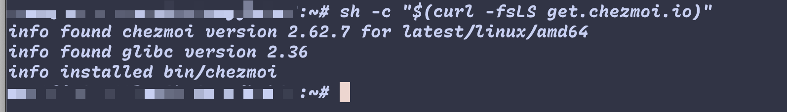
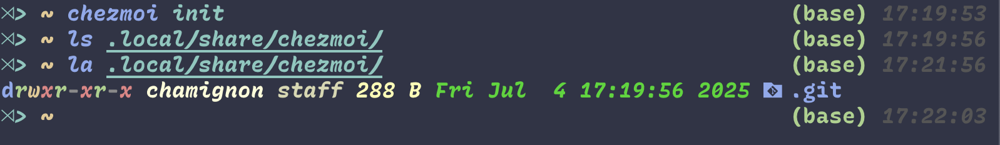
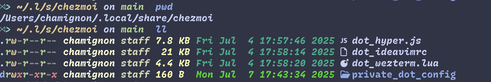
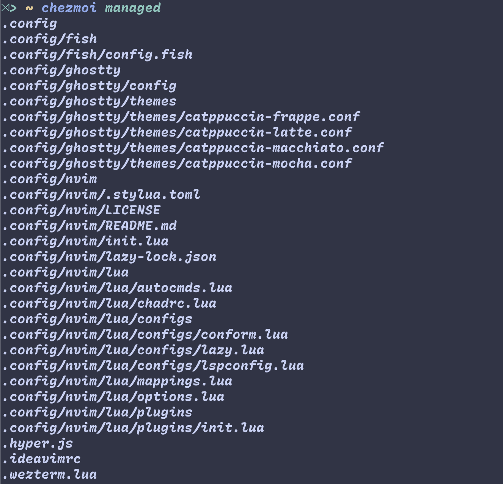
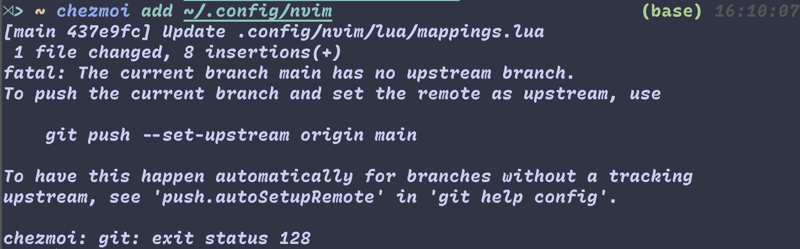
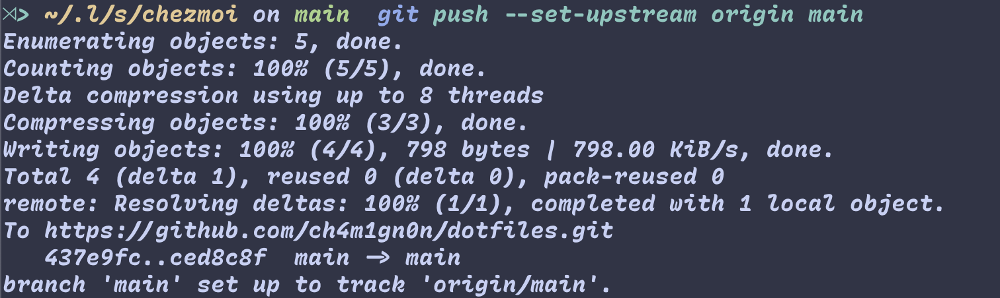
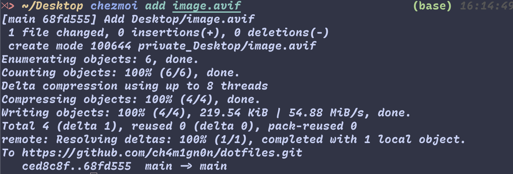
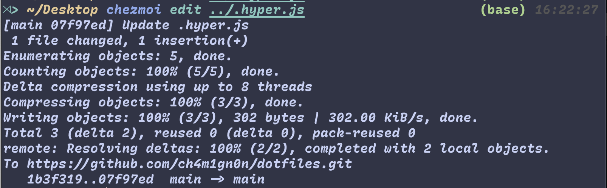

之前一直使用 github 裸仓库 管理 dotfile 的同步，最近在处理服务器同步冲突时，不小心 `clean -fd` 把 `home` 目录清了干净。痛定思痛，来尝试下用 Chezmoi 管理。
[参考文章](https://ivonblog.com/posts/chezmoi-manage-dotfiles/)
## 0x00 安装
### 1. mac

```bash
brew install chezmoi

# 验证安装成功 
chezmoi --version
```

### 2. Debian 服务器
直接下载 二进制文件
```bash
sh -c "$(curl -fsLS get.chezmoi.io)"
```

## 0x01 初始化
```bash
chezmoi init
```
会创建这个文件夹`.local/share/chezmoi/`

## 0x02 管理dotfiles

```bash
# 添加 dotfiles
chezmoi add ~/.hyper.js
#...
```
添加之后会将文件备份到 `.local/share/chezmoi/`

`chezmoi managed` 可以列出所有添加的文件


## 0x03 同步到 git
```
# 进入存储目录
cd .local/share/chezmoi/
# 或者 
chezmoi cd

# 同步(提前把库创建好)
git remote add origin https://github.com/{用户名}/dotfiles.git
git branch -M main
git add ./
git commit -m 'sync'
git push origin main
```
## 0x04 自动 push 更新 
配置 chezmoi 
`~/.config/chezmoi/chezmoi.toml`
添加：
```
[git]
    autoCommit = true
    autoPush = true

```
## 0x05 基本使用（类似 git）
#### 1. 修改本地文件后添加到 chezmoi 存储库
`chezmoi status` 查看 修改状态
我这里是修改了 `home` 目录的文件

想要将 本地修改应用到 chezmoi 库，只需再 `add` 下


这里添加文件报错了，手动在 chezmoi 库目录下`.local/share/chezmoi/`运行一下提示的命令就可以了
```
git push --set-upstream origin main
```

之后就可以正常同步了

#### 2. 修改存储库文件应用到本地
通过 `chezmoi edit` 编缉 chezmoi 库的文件，之后通过 `chezmoi apply` 应用到本地


注意这里的文件名是你本地的文件名。


## 0x06 多端同步
```bash
chezmoi init username  # 如果你的github库名叫dotfiles，不是的话用 url:
chezmoi init https://user@github.com/user/dotfiles.git
chezmoi apply -v # 应用配置
```

更多参考[官方文档](https://www.chezmoi.io/reference/commands/init/)