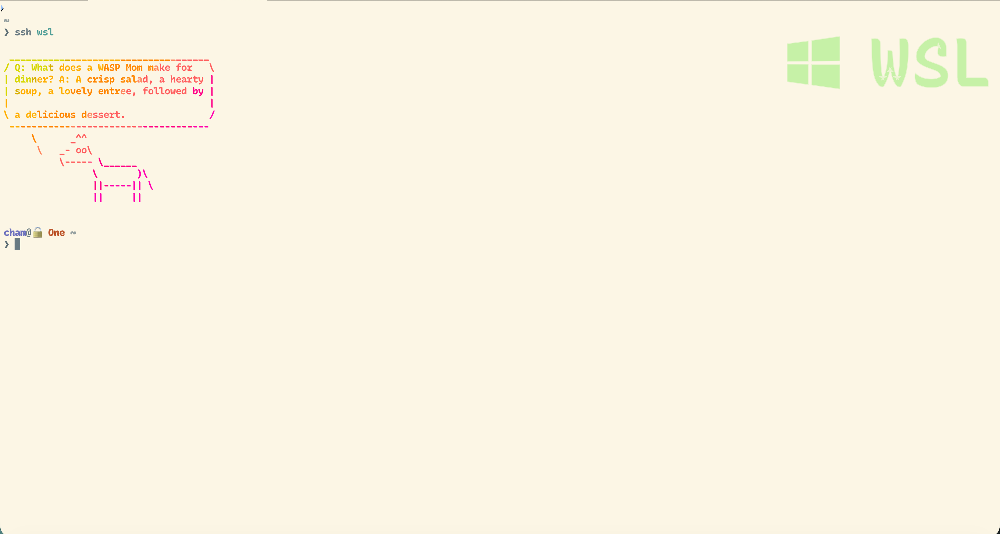

当前的基本情况和需求：
日常在公司用 Mac 办公，家里有台 Windows 台式，之前主要是单纯打游戏用的，只有mac上会运行一些开发测试环境，但有时候在家里想要测试些东西，mac不在手头，索性把环境迁移到windows。开发环境主要使用 wsl，web渗透测试之类的使用laragon配置。基本需求：随时能从 Mac 远程连回家里的 WSL 写代码，包括 VS Code Remote 开发，mac可以直接访问到内网各类服务。

折腾了一圈，最终形成了一套从组网、唤醒、连接到开发的完整方案，踩了不少坑，记录一下。

# 0x00 总体架构

```
Mac (公司) --[Tailscale]--> 路由器 (OpenWrt) --[子网路由]--> Windows --> WSL (Ubuntu)
```

- **组网**：通过 Tailscale 组网，OpenWrt 路由器开启子网路由，Mac 通过 Tailscale 访问家里内网
- **唤醒**：Mac 快捷指令 SSH 到路由器，通过 WOL 远程开机
- **远程连接**：SSH ProxyCommand 经 Windows 跳板自动拉起 WSL 并直连。
			  Mac 通过 Windows App 连接远程桌面。
- **开发配置**：VS Code Remote SSH 连接 WSL，iTerm2 Badge 区分终端

家里的网络拓扑：
- 路由器 OpenWrt（`192.168.66.1`），运行 Tailscale 并开启子网路由
- Windows 台式机（`192.168.66.66`），固定内网 IP
- NAS 等其他设备

# 0x01 Tailscale 组网

Tailscale 的安装和自建 DERP 中继服务器参考上一篇文章：[配置 tailscale 中继服务器 derper（已备案域名）](/2026/02/12/tailscale-derper-setup/)

这里只补充子网路由和 `tailscale serve` 的使用。

#### 1. 子网路由

在 OpenWrt 路由器上安装 Tailscale 后，开启子网路由广播家里的内网网段：
```sh
tailscale up --advertise-routes=192.168.66.0/24
```

然后在 Tailscale Admin Console 的机器列表中，找到路由器，点击 `Edit route settings`，勾选 `192.168.66.0/24` 并保存。

这样 Mac 加入 Tailscale 网络后，就能直接访问家里 `192.168.66.x` 的所有设备。

#### 2. tailscale serve

WSL 中配置 `tailscale serve`，方便从外部访问本地开发服务进行 web 测试：
```sh
tailscale serve --bg http://127.0.0.1:4000
```

查看状态：
```
$ tailscale serve status
https://xxx.xxxx.ts.net (tailnet only)
|— / proxy http://127.0.0.1:4000
```

这里发现配置 serve 暴露一个端口后，其他端口也可以通过 `http://xxx.xxxx.ts.net:<端口>` 直接访问。比如 Windows 上跑了个 3000 端口的服务，用 `http://xxx.xxxx.ts.net:3000` 就能访问到，虽然不是 HTTPS，但测试一些临时服务很方便。

# 0x02 远程唤醒 Windows

台式机不可能一直开着，首先要掌握一套能随时远程开关机的方式。

#### 1. BIOS 开启 WOL

在 BIOS 中开启 Wake-on-LAN（具体位置因主板而异，一般在电源管理或网络相关选项中）。

#### 2. 路由器安装 etherwake

OpenWrt 上使用 `etherwake` 发送 WOL 魔术包进行网络唤醒：
```sh
/usr/bin/etherwake -i br-lan <MAC地址>
```

# 0x03 macOS 快捷指令

在 iOS/macOS 的"快捷指令"中发现可以直接运行ssh命令，这样极大的方便了一些常用命令的操作。直接配置开关机快捷指令，添加到主屏幕，用的时候点一下就行。或者直接通过Siri 触发，非常方便。

#### 1. 远程开机
> 因为 iOS 上 Surge 和 Tailscale 不能同时跑（只能连一个 VPN），所以指令里需要先切到 Tailscale，操作完再切回 Surge。Mac 上两者可以同时运行。

```
1. Connect to Tailscale VPN
2. Show Alert: 是否确认开机？
3. Wait 5 seconds
4. Run Script over SSH (连接路由器 用户):
     /usr/bin/etherwake -i br-lan <MAC地址>
5. Connect to Surge VPN
```

#### 2. 远程关机

```
1. Connect to Tailscale VPN
2. Show Alert: 确定要关机么？
3. Show Alert: 再次确认是否已保存必要文件！！！
4. Run Script over SSH (连接 Windows 用户):
     shutdown /s /t 0
5. Connect to Surge VPN
```

#### 3. clawdbot一键开关
快捷指令能连ssh运行命令之后，一些常用操作就方便很多了。结合之前爆火的 clawdbot，我安装在wsl之后，配置了一个一键开关的快捷指令。下面是用到的命令。
```bash
# 检查状态
wsl systemctl --user is-active --quiet clawdbot-gateway; if ($?) { "Running" } else { "Stopped" }

# 停止服务
wsl systemctl --user stop clawdbot-gateway

# 开启服务
wsl systemctl --user start clawdbot-gateway
```

# 0x04 SSH 连接 WSL

这部分踩坑最多，先说结论。

#### 1. 最终方案

核心思路：SSH 先连 Windows，通过 `wsl` 命令拉起 WSL 并启动即时模式的 sshd，实现"一条命令直连 WSL"。

`~/.ssh/config`：
```
Host router
    HostName 192.168.66.1
    User root
    Port 22
    IdentityFile ~/.ssh/id_ed25519

Host win
    HostName 192.168.66.66
    User cham1
    Port 22
    IdentityFile ~/.ssh/id_ed25519

Host wsl
    HostName localhost
    User cham
    ProxyCommand ssh -q -T win "wsl -d Ubuntu-24.04 -u root --exec /usr/sbin/sshd -i"
    IdentityFile ~/.ssh/id_ed25519
    ServerAliveInterval 60
    StrictHostKeyChecking no
    UserKnownHostsFile /dev/null
    LogLevel ERROR
```

关键参数说明：
- `ProxyCommand`：先 SSH 到 `win`，然后执行 `wsl -d Ubuntu-24.04` 启动 WSL，`--exec /usr/sbin/sshd -i` 以即时模式启动 sshd 对接管道
- `-q -T`：静默模式，不分配伪终端，防止 PowerShell 输出干扰 SSH 协议
- `ServerAliveInterval 60`：保持连接活跃
- `StrictHostKeyChecking no` + `UserKnownHostsFile /dev/null`：跳过 localhost 的 host key 检查
- `LogLevel ERROR`：屏蔽 `Permanently added 'localhost' to the list of known hosts` 的提示

#### 2. 踩坑过程

**尝试一：RemoteCommand 进入 WSL**

最开始直接 SSH 连 Windows，配置 `RemoteCommand` 自动执行 `wsl` 进入 WSL shell。问题是 VS Code Remote SSH 连上去后默认环境是 Windows PowerShell，不会进入 WSL 开发环境。

**尝试二：直连 WSL SSH**

之后在 WSL 里开 SSH 服务，Mac 直连 WSL SSH。连上之后先后遇到了一些问题：

**问题 1：VS Code 不支持 fish 进行服务端安装**

VS Code Remote SSH 连接时卡在 "Installing VS Code Server" 或无限超时。原因是 WSL 默认 shell（`chsh`）设为 fish，其非 POSIX 语法会破坏 VS Code 的握手协议。

当时的解决思路比较扭曲，分了好几步：
1. 把 WSL 默认 shell 改回 bash，但这样 SSH 连过去也变成了 bash
2. 在 Mac 的 fish config 里给 ssh wsl 追加 `-t "exec fish"`，保证手动 SSH 进去还是 fish
3. 在 VS Code 里配置 `terminal.integrated.defaultProfile.linux` 指定终端用 fish

这套 workaround 虽然能跑，但太别扭了。后来搜到一个简单得多的方案：在 VS Code 设置中禁用新版连接架构：
```json
{
    "remote.SSH.useLocalServer": false,
    "remote.SSH.remotePlatform": {
        "wsl": "linux"
    }
}
```

加上这个之后，VS Code 对 fish 的兼容就没问题了，上面那些 workaround 就都不用了。

**问题 2：WSL 需要手动唤醒且会自动关闭**

VS Code 的问题解决后，又发现直连 WSL SSH 的两个问题：
1. Windows 刚开机时 WSL 还没启动，SSH 连不上，每次得先连 Windows 手动启动 WSL
2. WSL 空闲一段时间后自动关闭，SSH 自动断开后就再也连不上，还得再连 Windows 手动启动 WSL

这里尝试设置了 `.wslconfig` 的 `vmIdleTimeout=300000` 甚至 `vmIdleTimeout=-1`，但是感觉都没有效果，还是会断。

**最终方案：ProxyCommand**

最后，再经过与 AI 的一番拉扯，发现了 `ProxyCommand` 功能，使用这个后基本上满足了我的需求：
- WSL 没启动？`wsl -d Ubuntu-24.04` 命令会**自动拉起** WSL
- WSL 空闲关闭？只要 SSH 连接在，Windows 端的 `wsl.exe` 进程就在运行，WSL 不会被判定为空闲

# 0x05 iTerm2 SSH Badge

最初我 wsl shell 和 mac 本地 shell 使用相同的 starship 主题，相同的fish shell配置，导致很容易分不清现在在哪个shell里，这才搞出下面这种方案。

通过 iTerm2 的 Badge 功能，在 SSH 时自动显示目标主机标识。
效果如下：
SSH 到 WSL 时，右上角显示 Badge：

本地 shell，没有 Badge：


> Badge 颜色在 iTerm2 中配置：Settings → Profiles → 选择 Profile → Colors → Badge

不过，现在我通过chezmoi 配置了不同的starship主题，不过badge看起来很清晰，也保留了下来。

#### 1. fish 函数

在 `~/.config/fish/config.fish` 中添加一个 `ssh` wrapper 函数，连接时自动发送 iTerm2 Badge，断开时自动清除：

```fish
function ssh
    set -l target_host ""

    # 1. 提取主机名
    for arg in $argv
        if not string match -q -- "-*" $arg
            set target_host $arg
            break
        end
    end

    if test -z "$target_host"
        command ssh $argv
        return
    end

    # 2. 图标映射（需要 Nerd Font 支持）
    set -l display_text "$target_host"

    switch $target_host
        case "wsl"
            set display_text " WSL"
        case "windows" "win"
            set display_text " PowerShell"
        case "linux" "ubuntu" "debian"
            set display_text " Linux"
        case "aliserver"
            set display_text " Aliserver"
        case "router" "gateway" "openwrt" "asus" "ubnt" "wifi"
            set display_text "󰑩 Router"
        case "mac" "darwin"
            set display_text " MacOS"
        case "prod" "production"
            set display_text "🚨 PROD"
        case "*"
            # 默认：转大写并加个通用服务器图标
            set display_text " "(string upper $target_host)
    end

    # 3. 发送 Badge
    set -l b64_badge (echo -n "$display_text" | base64)
    printf "\e]1337;SetBadgeFormat=%s\a" "$b64_badge"

    # 4. 执行 SSH
    command ssh $argv

    # 5. 清除 Badge
    printf "\e]1337;SetBadgeFormat=\a"
end
```

#### 2. Starship 主题区分

除了 Badge，还通过 chezmoi 模板为不同系统配置了不同的 Starship 提示符，SSH 到 WSL 时强制显示用户名和主机名：

```toml
[hostname]
{{- if eq .chezmoi.os "darwin" }}
ssh_only = true   # Mac: 仅 SSH 时显示
{{- else }}
ssh_only = false  # Linux/WSL: 强制显示
{{- end }}
format = "[$ssh_symbol$hostname]($style) "
style = "bold red"
ssh_symbol = "🔒 "

[username]
style_user = "purple bold"
style_root = "black bold red"
format = "[$user]($style)@"
{{- if eq .chezmoi.os "darwin" }}
show_always = false # Mac: 本地隐藏
{{- else }}
show_always = true  # Linux/WSL: 强制显示
{{- end }}
```

# 0x06 其他踩坑

#### 1. .wslconfig 配置项放错位置

**问题**：WSL 启动时报错 `Unknown key 'wsl2.autoMemoryReclaim'`。

**原因**：`autoMemoryReclaim` 属于目前实验性功能，必须放在 `[experimental]` 下面。

 `.wslconfig` 配置如下：
```ini
[wsl2]
networkingMode=mirrored
vmIdleTimeout=300000

[experimental]
sparseVhd=true
autoMemoryReclaim=gradual  # 必须在 [experimental] 下
```

#### 2. cargo check 在 WSL 中极慢

**问题**：在 WSL 中运行 `cargo check`、rust-analyzer 分析都特别慢，vscode 内语法检查的速度不忍直视。

**原因**：问AI说是WSL 2 跨文件系统的 I/O 性能比原生 Linux 文件系统慢 5-10 倍，我项目文件放在 Windows 文件系统（`/mnt/d/...`）上，导致的性能问题。

**解决方案**：将项目迁移到 WSL 内部文件系统
