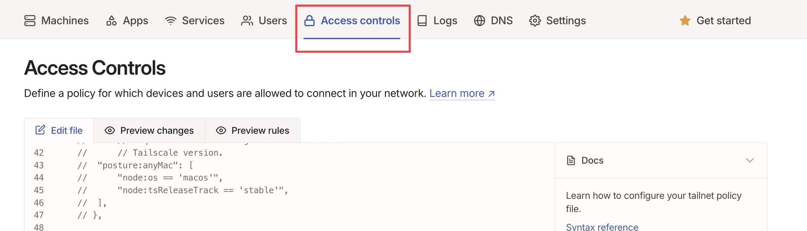
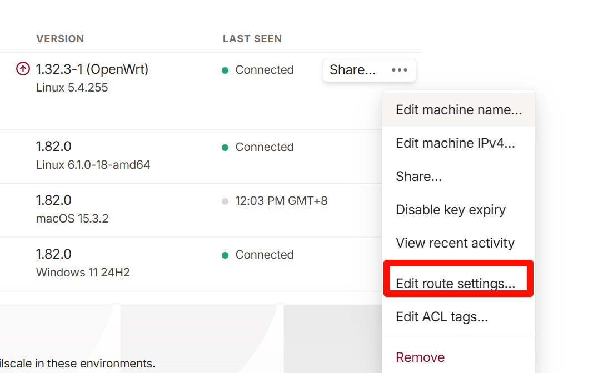
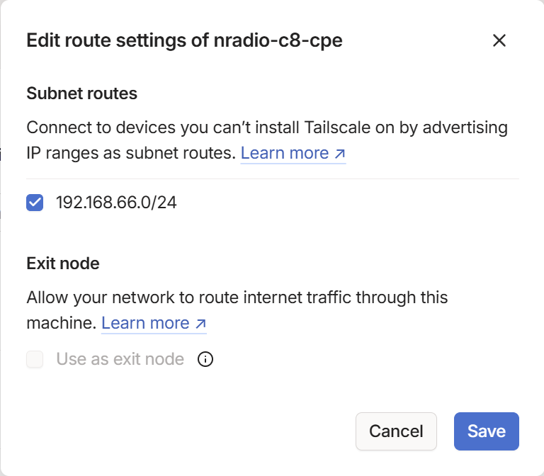

参考文章：
[我的服务器系列：tailscale使用自定义derper服务器（docker部署） - 且炼时光](https://always200.com/tailscale-derper-docker#%E5%9B%9B-tailscale%E9%85%8D%E7%BD%AE)
[自建 DERP 中继服务器，从此 Tailscale 畅通无阻-腾讯云开发者社区-腾讯云](https://cloud.tencent.com/developer/article/1977129)

# 总体设计

服务器版本
> Linux iv-ydkbpuraiocva4f6n5n5 6.1.0-18-amd64 #1 SMP PREEMPT_DYNAMIC Debian 6.1.76-1 (2024-02-01) x86_64 GNU/Linux

目前存在两个 http 服务，syncthing 用于文件同步，derper 用于 隧道搭建。设计如下：
**syncthing服务**，放在 `11111` 端口，
**derper** 需要启动一个 `http` 服务，放在 `3443` 端口，
通过 nginx stream 模块进行流量转发，共用 `443` 端口。
整体思路如下：
**一、nginx 网站配置文件中配置两个 web 服务：**
 1. `80` 端口重定向到 `443`
 2. `12443` 端口 代理后端 `11111` 端口 `http` 服务，并为其配置 `https`

 **二、nginx 服务配置启动 stream 模块**
配置 stream 模块通过 SNI 识别，将不同域名映射到不同端口

# 0x00 安装并配置 nginx
#### 1. 安装 nginx
```
apt install nginx
```
#### 2. 配置 stream
将下面内容加入 `/etc/nginx/nginx.conf`
> 配置 Nginx  **`stream` 模块**中的一个服务器块，用来处理 **TCP 流量**（例如 HTTPS 请求）并通过 **SNI（Server Name Indication）** 将流量转发到不同的后端服务器。

首次配置后执行 `nginx -t` 报错，缺少 stream 模块：
```
nginx: [emerg] unknown directive "stream" in /etc/nginx/nginx.conf:12
nginx: configuration file /etc/nginx/nginx.conf test failed
```
安装该模块：
```sh
apt install -y libnginx-mod-stream
```
安装后再次测试：
```
nginx: the configuration file /etc/nginx/nginx.conf syntax is ok
nginx: configuration file /etc/nginx/nginx.conf test is successful
```

nginx.conf 配置文件
```
user www-data;
worker_processes auto;
pid /run/nginx.pid;
error_log /var/log/nginx/error.log;
include /etc/nginx/modules-enabled/*.conf;

events {
        worker_connections 768;
        # multi_accept on;
}

stream {
    # 这里就是 SNI 识别，将域名映射成一个配置名
    map $ssl_preread_server_name $backend_name {
    # 把 derp.ch4m1gn0n.site 的流量转到 derper 的 upstream
        derp.ch4m1gn0n.site derper;
    # 域名都不匹配情况下的默认值
        default sync;
    }
    # 监听 443 并开启 ssl_preread
    server {
        listen 443 reuseport;
        listen [::]:443 reuseport;
        proxy_pass  $backend_name;
        ssl_preread on;
    }
    upstream derper {
      server 127.0.0.1:3443;
    }
    upstream sync {
      server 127.0.0.1:12443;
    }
}

http {

        ##
        # Basic Settings
        ##

        sendfile on;
        tcp_nopush on;
        types_hash_max_size 2048;
        # server_tokens off;

        # server_names_hash_bucket_size 64;
        # server_name_in_redirect off;

        include /etc/nginx/mime.types;
        default_type application/octet-stream;

        ##
        # SSL Settings
        ##

        ssl_protocols TLSv1 TLSv1.1 TLSv1.2 TLSv1.3; # Dropping SSLv3, ref: POODLE
        ssl_prefer_server_ciphers on;

        ##
        # Logging Settings
        ##

        access_log /var/log/nginx/access.log;

        ##
        # Gzip Settings
        ##

        gzip on;

        # gzip_vary on;
        # gzip_proxied any;
        # gzip_comp_level 6;
        # gzip_buffers 16 8k;
        # gzip_http_version 1.1;
        # gzip_types text/plain text/css application/json application/javascript text/xml application/xml application/xml+rss text/javascript;

        ##
        # Virtual Host Configs
        ##

        include /etc/nginx/conf.d/*.conf;
        include /etc/nginx/sites-enabled/*;
}


```
#### 3. 修改 nginx  网站配置
两部分内容
 1. 80 端口重定向到 443
 2. 12443 端口 代理后端 11111 端口 http 服务，并配置 https
##### 3.1 为 用于 11111 端口的域名生成证书
生成sync 域名证书
> derper 证书，docker 内部会自动用 letsencrypt 申请
```shell
certbot certonly --standalone -d sync.ch4m1gn0n.site
```

##### 3.2 网站配置如下：
debian 位于 `/etc/nginx/sites-enabled/default`
```
server {
        listen 80 default_server;
        listen [::]:80 default_server;

        server_name _;

        return 301 https://$host$request_uri;
}

server {
        listen 12443 ssl http2;
        listen [::]:12443 ssl http2;

        server_name sync.ch4m1gn0n.site;

        # 配置 SSL 证书
        ssl_certificate /etc/letsencrypt/live/sync.ch4m1gn0n.site/fullchain.pem;
        ssl_certificate_key /etc/letsencrypt/live/sync.ch4m1gn0n.site/privkey.pem;

        # 推荐的 SSL 配置
        ssl_protocols TLSv1.2 TLSv1.3;
        ssl_ciphers HIGH:!aNULL:!MD5;

        # 转发到后端服务
        location / {
            proxy_pass http://127.0.0.1:11111; # 后端服务的 HTTP 端口
            proxy_set_header Host $host;
            proxy_set_header X-Forwarded-Proto $scheme;
            proxy_set_header X-Real-IP $remote_addr;
            proxy_set_header X-Forwarded-For $proxy_add_x_forwarded_for;
        }
}
```
到此，nginx 就配置完成了

# 0x01 安装 tailscale
安装过程请参考[官方文档](https://tailscale.com/kb/1174/install-debian-bookworm)
# 0x02 安装derper
#### 1. 启动 docker
指定 `DERP_VERIFY_CLIENTS=true` 防白嫖

使用 `DERP_VERIFY_CLIENTS` 则需要挂载 `tailscaled.sock`，使容器能访问到外部机器 tailscale 进程。
`/var/run/tailscale/tailscaled.sock:/var/run/tailscale/tailscaled.sock`

指定 `DERP_DOMAIN` 之后，容器会自动申请并续期证书。

最终启动命令，其中 3443 是 web 服务端口，3478 是隧道通信端口。
```sh
docker run -d -p 3443:443 -p 3478:3478/udp --name derper --restart=always -v /data/derper/certs:/app/certs -v /var/run/tailscale/:/var/run/tailscale/ -e DERP_ADDR=":443" -e DERP_VERIFY_CLIENTS=true -e DERP_DOMAIN="derp.ch4m1gn0n.site" fredliang/derper
```

# 0x03 添加 derper 到 tailscale
在 tailscale 官网 Admin Console 修改 access control 配置

添加如下内容：
> 字段内容参考[官方文档](https://tailscale.com/kb/1118/custom-derp-servers#add-the-custom-derp-servers-to-your-tailnet)
```
	"derpMap": {
		"OmitDefaultRegions": true, // true 是 关闭默认 regions
		"Regions": {
			"900": {
				"RegionID":   900,
				"RegionCode": "huo",
				"RegionName": "Huo",
				"Nodes": [{
					"Name":     "huo",
					"RegionID": 900,
					"HostName": "derp.ch4m1gn0n.site",
					"DERPPort": 443,
				}],
			},
		},
	},
```
测试 `tailscale netcheck`：
```
Report:
    * Time:                          2025-04-02T13:40:17.2468582Z
    * UDP:                           false
    * IPv4:                          (no addr found)
    * IPv6:                          no, but OS has support
    * MappingVariesByDestIP:
    * PortMapping:
    * CaptivePortal:                 false
    * Nearest DERP:                  Huo
    * DERP latency:
        - huo: 26.5ms  (Huo)
```


# 0x04 启动子路由
在路由器中打开子路由功能
```
tailscale up --advertise-routes=192.168.66.0/24
```

在 Admin Console 中找到对应机器，点击 `Edit route settings`：

勾选子网路由并保存：

启动后，即可在同 tailscale 网络内访问内网 66 网段
